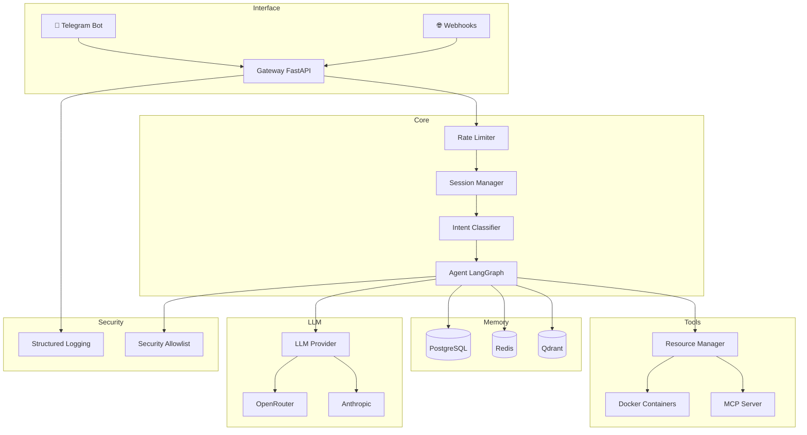
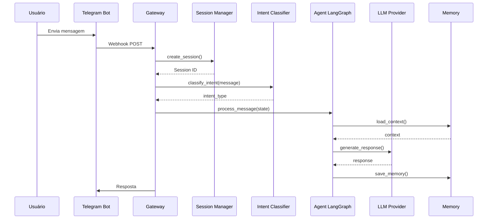
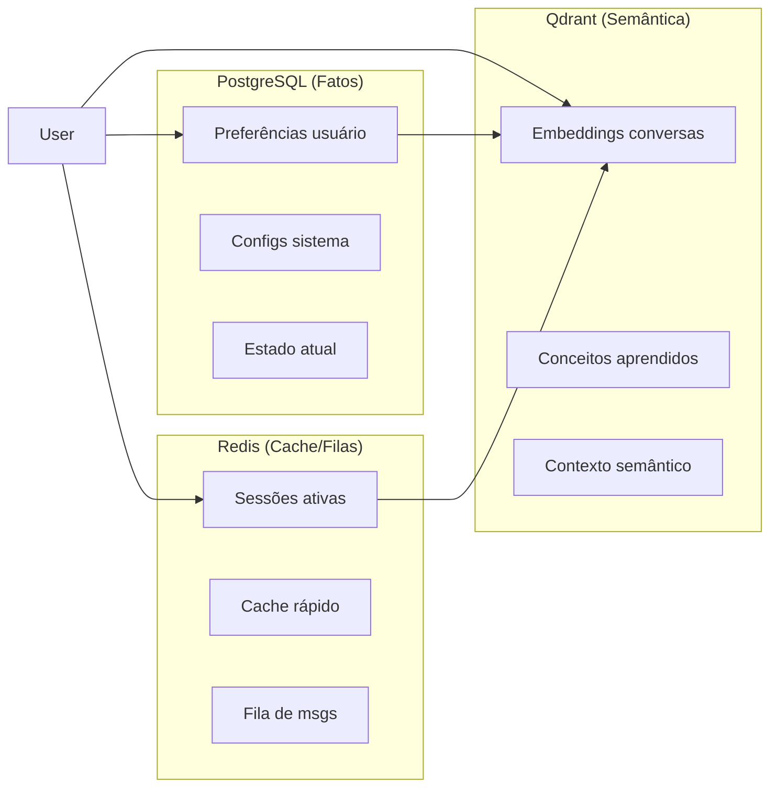
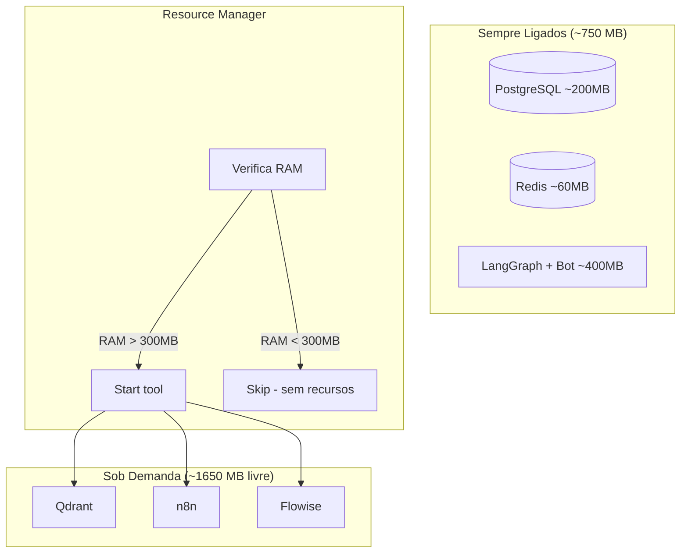
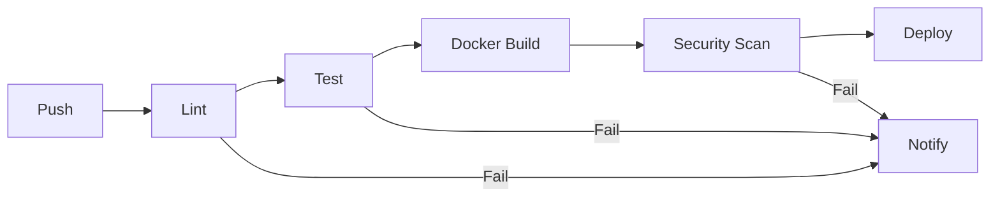

# Arquitetura — AgentVPS

> **⚠️ IMPORTANTE:** Leia [`CONTRIBUTING.md`](CONTRIBUTING.md) primeiro para entender como contribuir.

## 🎯 Visão Geral

```
┌─────────────────────────────────────────────────────────────────┐
│                    VPS 2.4 GB RAM (AGENTE)                      │
│                                                                  │
│  ┌─────────────────────────────────────────────────────────┐  │
│  │                    CÉREBRO (~500 MB)                    │  │
│  │  ┌─────────────────────────────────────────────────────┐  │  │
│  │  │  CLI (Kilocode/Claude) + LangGraph + Agente       │  │  │
│  │  └─────────────────────────────────────────────────────┘  │  │
│  └─────────────────────────────────────────────────────────┘  │
│                                                                  │
│  ┌─────────────────────────────────────────────────────────┐  │
│  │              SEMPRE LIGADOS (~750 MB TOTAL)             │  │
│  │  ┌─────────────┐  ┌─────────────┐  ┌─────────────────┐  │  │
│  │  │ PostgreSQL  │  │    Redis    │  │   LangGraph     │  │  │
│  │  │   (200 MB)  │  │   (60 MB)   │  │  Resource Mgr   │  │  │
│  │  └─────────────┘  └─────────────┘  │   Telegram Bot  │  │  │
│  │                                    └─────────────────┘  │  │
│  └─────────────────────────────────────────────────────────┘  │
│                                                                  │
│  ┌─────────────────────────────────────────────────────────┐  │
│  │              SOB DEMANDA (~1650 MB LIVRE)              │  │
│  │  ┌─────────────┐  ┌─────────────┐  ┌─────────────────┐  │  │
│  │  │   Qdrant   │  │     n8n     │  │    Flowise     │  │  │
│  │  │ (memória   │  │ (automações)│  │  (workflows)   │  │  │
│  │  │  semântica)│  │             │  │                 │  │  │
│  │  └─────────────┘  └─────────────┘  └─────────────────┘  │  │
│  └─────────────────────────────────────────────────────────┘  │
│                                                                  │
│  📱 Interface: Telegram Bot (@Molttaitbot)                       │
│  🧠 Memória: PostgreSQL + Redis + Qdrant                        │
│  🔧 Ferramentas: Docker containers sob demanda                  │
└─────────────────────────────────────────────────────────────────┘
```

## 🏗️ Arquitetura de Camadas



## 📦 Estrutura de Diretórios

```
AgentVPS/
├── core/                          # 🎯 Núcleo do sistema
│   ├── gateway/                   # 🌐 HTTP endpoints
│   │   ├── main.py                # FastAPI app
│   │   ├── adapters.py            # Telegram/Webhook adapters
│   │   ├── rate_limiter.py        # Rate limiting
│   │   └── session_manager.py      # Sessões Redis
│   │
│   ├── llm/                       # 🤖 Integração LLM
│   │   ├── provider.py            # Abstração de providers
│   │   ├── openrouter_client.py    # OpenRouter client
│   │   ├── agent_identity.py       # Prompt de identidade
│   │   └── prompt_composer.py      # Composição de prompts
│   │
│   ├── security/                   # 🔒 Segurança
│   │   └── allowlist.py           # Allowlist de ações
│   │
│   ├── resilience/                 # 🛡️ Resiliência
│   │   └── circuit_breaker.py      # Circuit breaker
│   │
│   ├── health_check/               # 🏥 Monitoramento
│   │   └── doctor.py               # Health checks
│   │
│   ├── structured_logging/         # 📊 Logging
│   │   └── structured.py           # JSON structured logs
│   │
│   ├── capabilities/               # ⚡ Capacidades
│   │   └── registry.py             # Registro de skills
│   │
│   ├── resource-manager/           # 📦 Recursos
│   │   └── manager.py              # Gerenciamento RAM
│   │
│   └── vps_langgraph/             # 🧠 Agente LangGraph
│       ├── graph.py               # Definition do grafo
│       ├── state.py               # Estado do agente
│       ├── nodes.py               # Nodes do workflow
│       ├── memory.py              # Memória PostgreSQL
│       ├── learnings.py           # Aprendizados
│       ├── intent_classifier.py  # Classificação intents
│       ├── error_handler.py      # Tratamento erros
│       └── smart_responses.py    # Respostas smart
│
├── telegram-bot/                  # 📱 Bot Telegram
│   ├── bot.py                    # Bot principal
│   └── telegram_handler.py        # Handler de logs
│
├── tests/                         # 🧪 Testes unitários
│   ├── test_gateway.py
│   ├── test_circuit_breaker.py
│   ├── test_health_check.py
│   ├── test_prompt_composer.py
│   ├── test_structured_logging.py
│   ├── test_allowlist.py
│   └── test_llm_provider.py
│
├── configs/                       # ⚙️ Configurações
│   ├── docker-compose.core.yml    # Serviços always-on
│   ├── init-db.sql                # DB initialization
│   └── .env.example               # Exemplo de variáveis
│
├── scripts/                       # 🔧 Scripts
│   └── deploy.sh                  # Deploy script
│
├── docs/                          # 📚 Documentação
│   ├── ARCHITECTURE.md           # Este arquivo
│   ├── MCP_SERVER.md             # MCP Server docs
│   └── adr/                      # Architecture Decision Records
│
├── .kilocode/                     # 🧠 Memory Bank (IA)
│   └── rules/
│       ├── memory-bank/
│       │   ├── brief.md          # Estado atual
│       │   ├── context.md         # Arquitetura
│       │   ├── deployment-tracker.md # Tracker progresso
│       │   ├── history.md         # Histórico decisões
│       │   └── project-context.md # Contexto projeto
│       └── vps-agent-rules.md    # Regras obrigatórias
│
├── requirements.txt               # Dependências Python
├── pyproject.toml                # Configuração projeto
└── README.md                     # Visão geral
```

## 🔄 Fluxo de Mensagem



## 🎯 Classificação de Intentos

```
┌─────────────────────────────────────────────────────────────────┐
│                    INTENT CLASSIFIER                             │
├─────────────────────────────────────────────────────────────────┤
│                                                                  │
│  COMMAND ──────► /status, /help, /restart, /logs              │
│                  → Execução direta de comandos                  │
│                                                                  │
│  TASK ──────────► "liste containers", "mostre RAM"             │
│                  → Execução de tarefas complexas                │
│                                                                  │
│  QUESTION ─────► "qual a RAM?", "como você funciona?"          │
│                  → Resposta informativa                          │
│                                                                  │
│  CHAT ──────────► "oi", "tudo bem?", "obrigado"                 │
│                  → Conversa natural                             │
│                                                                  │
│  SELF_IMPROVE ──► "crie uma nova skill", "melhore você"        │
│                  → Auto-evolução do agente                      │
│                                                                  │
└─────────────────────────────────────────────────────────────────┘
```

## 💾 Camadas de Memória



## 🔧 Gerenciamento de Recursos



## 🔒 Segurança

### Allowlist de Ações

```python
# Tipos de permissão
ALLOW      # Permite direto
REQUIRE_APPROVAL  # Pede confirmação
DENY        # Bloqueia
```

### Categorias Protegidas

| Categoria | Ações Permitidas | Regras |
|-----------|------------------|--------|
| `read` | Ver status, logs, RAM | Sempre permitido |
| `command` | docker ps, git | Apenas allowlist |
| `write` | Criar arquivos | Requer aprovação |
| `delete` | Remover arquivos | Bloqueado |
| `network` | APIs externas | Rate limited |
| `database` | SQL queries | Apenas leitura |

## 🧪 Testes

### Pirâmide de Testes

```
        ┌─────────┐
       /   E2E    \    ← 5 testes (test_*.py)
      /   (10%)    \
     ├───────────────┤
    /   Integração    \  ← 30% dos testes
   /   (tests/test_*)  \
  ├─────────────────────┤
 /       Unitários       \ ← 60% dos testes
/       (tests/)          \
└─────────────────────────┘
```

### Cobertura Mínima

| Componente | Cobertura Mínima |
|------------|-----------------|
| Gateway | 80% |
| Circuit Breaker | 90% |
| Health Check | 90% |
| LLM Provider | 75% |
| Security | 85% |

## 📊 CI/CD Pipeline



## 📁 Referências

| Recurso | Link |
|---------|------|
| GitHub | https://github.com/Guitaitson/AgentVPS |
| CI/CD | https://github.com/Guitaitson/AgentVPS/actions |
| VPS | 107.175.1.42 |
| Telegram | @Molttaitbot |
| ADRs | [`docs/adr/`](docs/adr/) |
| Roadmap | [`.kilocode/rules/memory-bank/deployment-tracker.md`](.kilocode/rules/memory-bank/deployment-tracker.md) |

---

**⚠️ LEMBRE-SE:** Esta documentação deve ser atualizada sempre que a arquitetura mudar. Ver [`CONTRIBUTING.md`](CONTRIBUTING.md) para guidelines.
